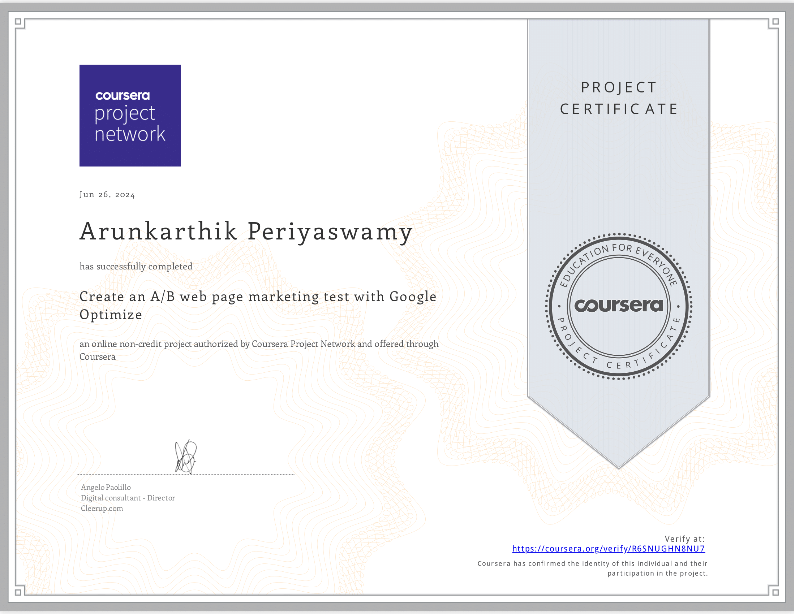

# AB-testing-proof-of-concept

> [!NOTE]
> [Coursera A/B testing accomplishments](https://coursera.org/share/75a50b645d5d361794b4e58440cf144b)
> 

## _(Udacity example)_ A/B testing can help you climb the peak of your current mountain. But it cannot help you decide which mountain you should climb. 

A/B Testing with Google Optimize (Coursera)

I completed the "Create an A/B web page and marketing test with Google Optimize" project-based course on Coursera. Through hands-on experience, I gained the skills to:

Set up Google Optimize: Integrated Google Optimize with Google Analytics for seamless A/B testing.
Create A/B Tests: Designed and implemented A/B tests to compare different web page variations and marketing strategies.
Optimize Test Parameters: Refined audience targeting, traffic allocation, and activation events to maximize test effectiveness.

### Key Takeaways:
Hands-On Learning: The course's Rhyme platform provided a practical, browser-based environment to apply concepts directly.
Google Tools Integration: Learned how to leverage the combined power of Google Optimize and Google Analytics for data-driven decision-making.
A/B Testing Fundamentals: Gained a solid understanding of the core principles and techniques involved in A/B testing.

### Additional Notes:
The course was taught by Angelo Paolillo, a seasoned digital consultant and educator.
A certificate of completion is available upon passing the final quiz.
Feel free to check out my project work in this repository for a closer look at my A/B testing implementation.

## Project Structure:

- Introduction to Google Optimize: Get acquainted with the tool and its purpose in A/B testing.
- Activation and Setup: Integrate Google Optimize with Google Analytics account and install the necessary browser extension.
- Sample Website Creation: Build a basic Google Site to serve as the foundation for A/B tests.
- Experience Setup: Configured first experiment within Google Optimize, defining the original page that wanted to be tested.
- Variant Creation: Designed an alternate version of page to compare against the original in the A/B test.
- Targeting Refinement: Set specific rules to determine which visitors will see which version of page.
- Objective Definition: Establish clear goals for A/B test, such as increased clicks or conversions.
- Final Configuration: Fine-tune traffic allocation, activation events, and other settings to optimize your experiment.

